# Federated Privacy Attack

This repository includes 8 privacy attack algorithms employed in federated learning. We follow the official implementations
released by the authors of the original paper, and remove redundant parts to make them as simple as possible.

Most algorithms have ability to reconstruct high-quality dummy images through the gradients with respect to a single
data or multiple averaged data. However, for a more complicated environment in federated learning that *averaged
gradients of batch data are locally computed and updated for multiple times*, these algorithms do not work well.

Among them, robbing the fed presents the best attack performance, however, it requires to insert an Imprint module
(containing two fully connected layers) before the learning model. This would significantly degrade the training
performance of federated learning which is unrealistic in the real world applications. Except that, since the magnitude
of model parameters of the second fully connected layer in Imprint module is *too large*, utilizing training model like
ConvNet may cause severe gradient explosion phenomenon to break down the whole process (result in nan stuff).

## Quick Start

### Gradient Attack
Our implementation reproduces and simulates the original environment of privacy attack upon computed gradients. It 
should be noticed that, this setting differs from an actual federated learning scenarios.

All the running shells are located in ./experiments/grad folder, and you can easily run for example DLG experiments by the following
command:
```sh
cd ./experiment/grad
sh dlg.sh
```
Note that, you can change *BASE_DATADIR in .sh file* to your own downloaded data directory.

### Server Side Attack
Produce privacy attacks in more realistic federated environment. The corresponding shells are located in
./experiments/fed folder, and you can easily run for example DLG method in federated learning by the following
command:
```sh
cd ./experiment/fed
sh dlg.sh
```

## Model
1) Training and evaluation modes are sensitive to the attack performance when dropout layers, batch normalization 
layers and so on are included in the constructed model

2) Dropout layer is sensitive to the outcome of generated dummy images, *remove it or set the dropout rate to zero*
would get much better and more valid results

3) For running attack method of *ig_multi* or *ig_weight*, the model is required to be wrapped by MetaModel, all the modules should be
built 'sequentially'. We reimplement the original source code to avoid *memory leakage* problem.

4) Utilizing pretrained models does affect the attack performance for GGL and feature inference attack in CPA.


## Data Processing
Scaling: for a typical 8-class image ranges from 0 to 255, the scaling process is $x_{\text{scaled}}=x/255$, where $x$
is the scaled image and $x$ is the original image.

Normalize: data normalization is sensitive to the quality of dummy images in GRNN. The process of normalization is
shown below:
```math
x_{\text{norm}}=\frac{x_{\text{scaled}}-x_{\mu}}{x_{\text{std}}}
```
where $x_{\mu}$ and $x_{\text{std}}$ are mean and standard deviation of the scaled data $x_{\text{scaled}}$, respectively.
According to our experimental simulations, setting 0.5 for both $x_{\mu}$ and $x_{\text{std}}$ may enhance the quality
of generated fake images

## Deep Leakage Gradient (DLG)
The original paper can be found [here](https://proceedings.neurips.cc/paper/2019/file/60a6c4002cc7b29142def8871531281a-Paper.pdf).
Just run the following command for gradient attack:
```sh
cd ./experiment/grad
sh dlg.sh
```
The corresponding outcomes of *10 repeated* experiments are presented below, where the first row contains the ground-truth images and the 
second row contains the reconstructed images. Each experiment only recover the gradients with respect to *1 ground-truth
image*.
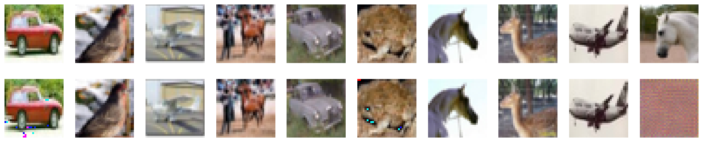

And run the following command for federated attack:
```sh
cd ./experiment/fed
sh dlg.sh
```
One dummy image generated in each of the *10 communication rounds* is shown below:
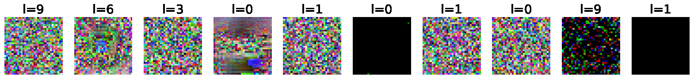

## Improved Deep Leakage Gradient (iDLG)
The original paper can be found [here](https://arxiv.org/pdf/2001.02610.pdf).
Just run the following command for gradient attack:
```sh
cd ./experiment/grad
sh idlg.sh
```
The corresponding outcomes of *10 repeated* experiments are shown below, where the first row contains the ground-truth images and the 
second row contains the reconstructed images. Each experiment only recover the gradients with respect to *1 ground-truth image*
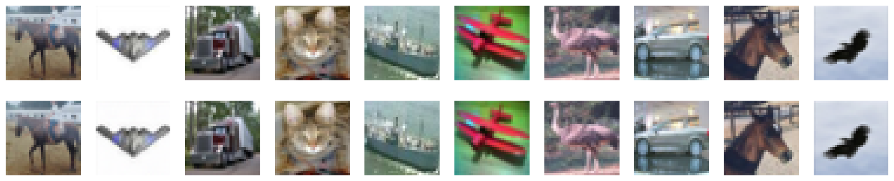

And run the following command for federated attack:
```sh
cd ./experiment/fed
sh idlg.sh
```
One dummy image generated in each of the *10 communication rounds* is shown below:
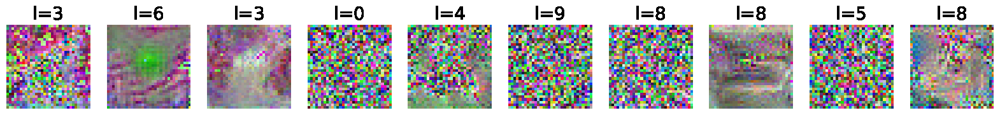

## Inverting Gradient
The original paper can be found [here](https://proceedings.neurips.cc/paper/2020/file/c4ede56bbd98819ae6112b20ac6bf145-Paper.pdf).
Just run the following command for gradient attack:
```sh
cd ./experiment/grad
sh ig.sh
```
The outcomes of multi-images (10) recovery for multiple gradient descent steps are shown below, where the first row 
contains the ground-truth images and the second row contains the reconstructed images. Each experiment simultaneously
recovers *10 images*.
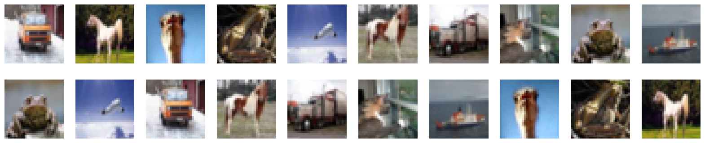

And run the following command for federated attack:
```sh
cd ./experiment/fed
sh ig.sh
```
8 dummy images generated in each of the *10 communication rounds* are shown below:
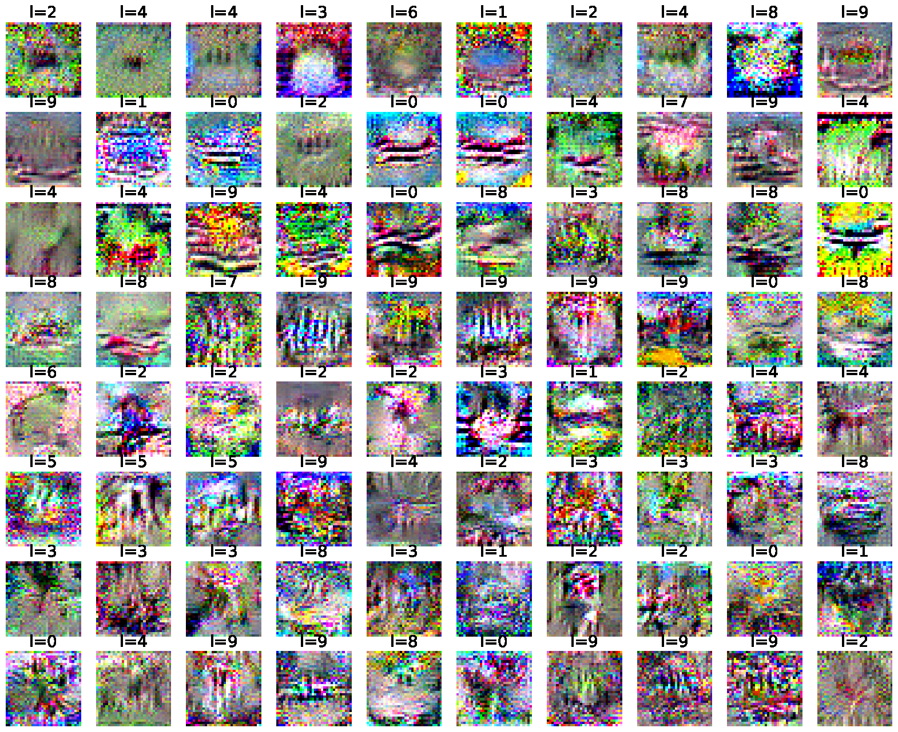

## Robbing the Fed
The original paper can be found [here](https://arxiv.org/pdf/2110.13057).
Just run the following command for gradient attack:
```sh
cd ./experiment/grad
sh rtf.sh
```
The outcomes of 64 ground-truth-images recovery are shown below:
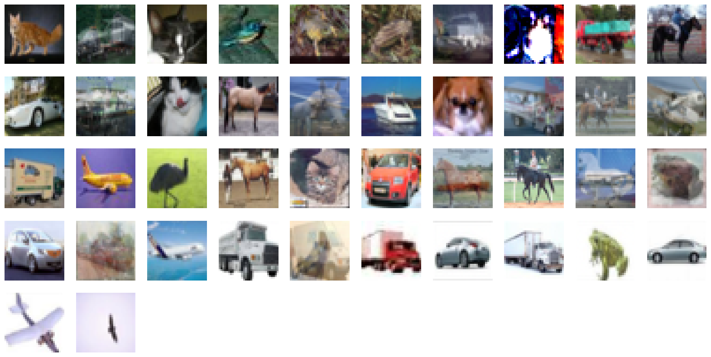

And run the following command for federated attack:
```sh
cd ./experiment/fed
sh rtf.sh
```
Batched dummy images (the number is undeterministic) generated in *1 communication rounds* are shown below:
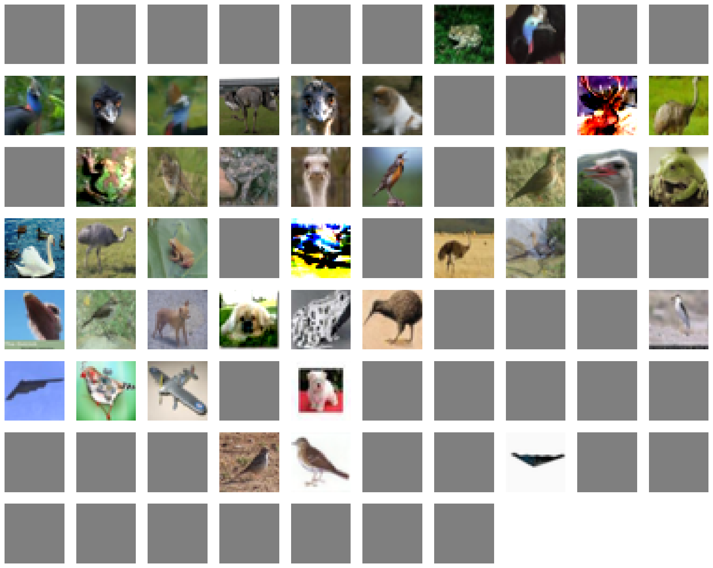

## Generative Gradient Leakage (GGL)
The original paper can be found [here](https://arxiv.org/pdf/2203.15696).
Just run the following command for gradient attack:
```sh
cd ./experiment/grad
sh ggl.sh
```
The corresponding outcomes of *10 repeated* experiments are shown below, where the first row contains the ground-truth images and the 
second row contains the reconstructed images. Each experiment only recover the gradients with respect to *1 ground-truth image*
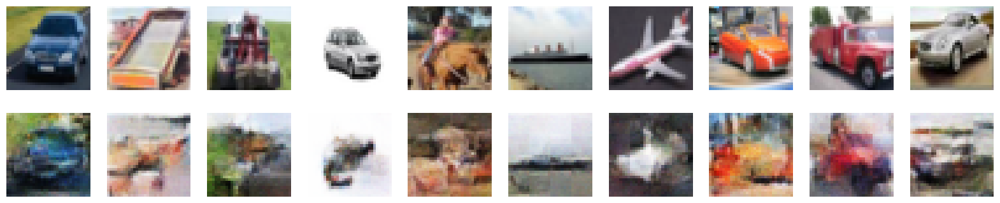

And run the following command for federated attack:
```sh
cd ./experiment/fed
sh ggl.sh
```
One dummy image generated in each of the *30 communication rounds* is shown below:
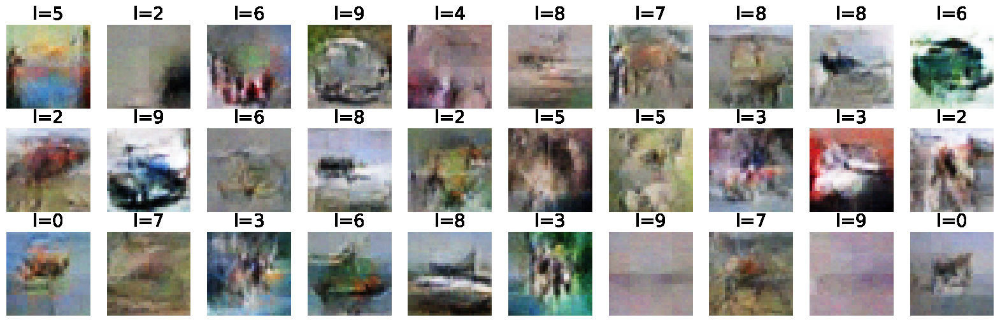

## Generative Regression Neural Network (GRNN)
The original paper can be found [here](https://dl.acm.org/doi/abs/10.1145/3510032).
Just run the following command for gradient attack:
```sh
cd ./experiment/grad
sh grnn.sh
```
The corresponding outcomes of *10 repeated* experiments are shown below *(no data normalization)*, where the first 4 rows contain the ground-truth images and the 
last 4 rows contain the reconstructed images. Each experiment only recover the gradients with respect to *4 ground-truth images*
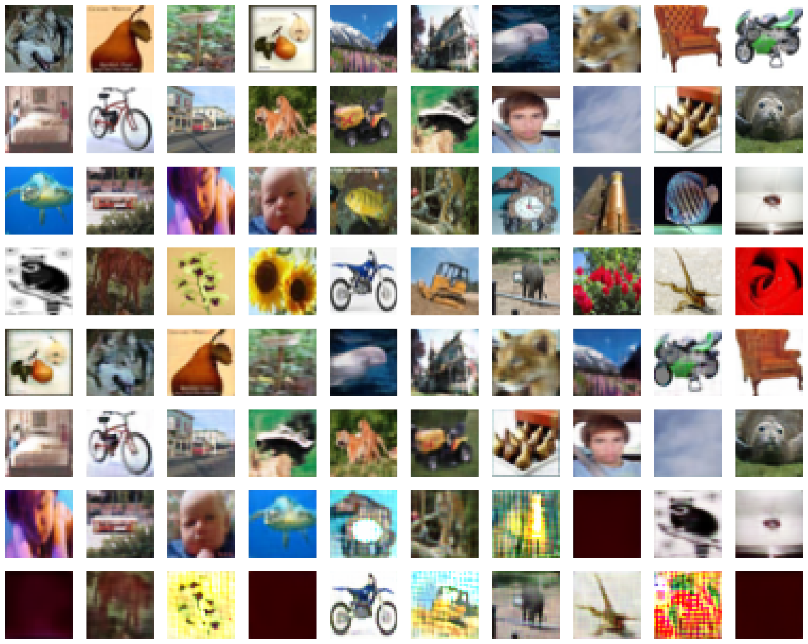

And run the following command for federated attack:
```sh
cd ./experiment/fed
sh grnn.sh
```
4 dummy images generated in each of the *10 communication rounds* is shown below:
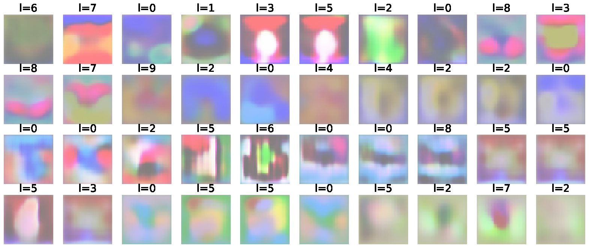

## Cocktail Party Attack (CPA)
The original paper can be found [here](https://proceedings.mlr.press/v202/kariyappa23a/kariyappa23a.pdf).
Just run the following command for gradient attack:
```sh
cd ./experiment/grad
sh cpa.sh
```
Only the outcome of cpa experiment is shown below (no feature inversion attack), where the first 5 rows contain the ground-truth images and the 
last 5 rows contain the reconstructed images. Each experiment only recover the gradients with respect to *50 ground-truth images*
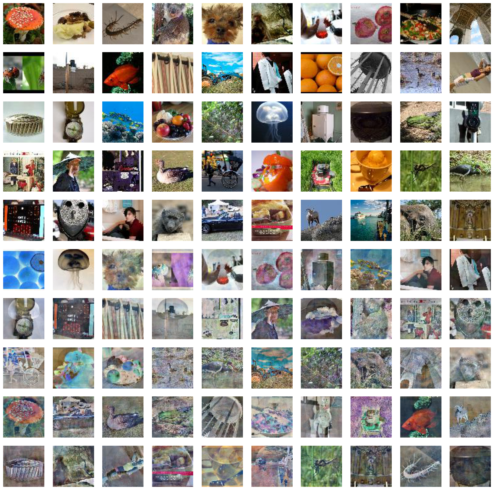

And run the following command for federated attack:
```sh
cd ./experiment/fed
sh cpa.sh
```
4 dummy images generated in each of the *10 communication rounds* is shown below:
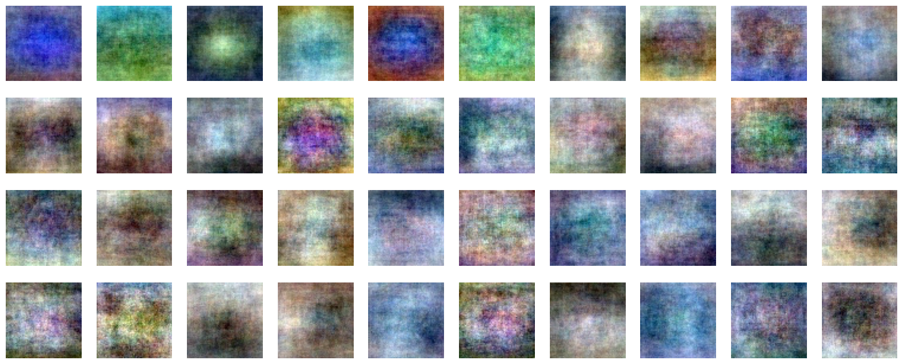